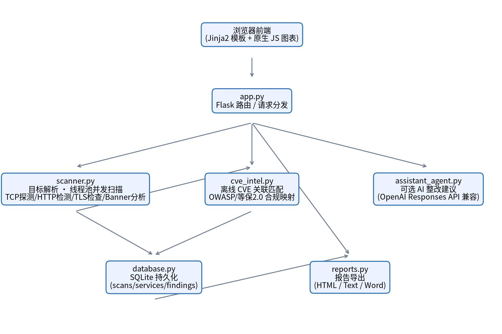
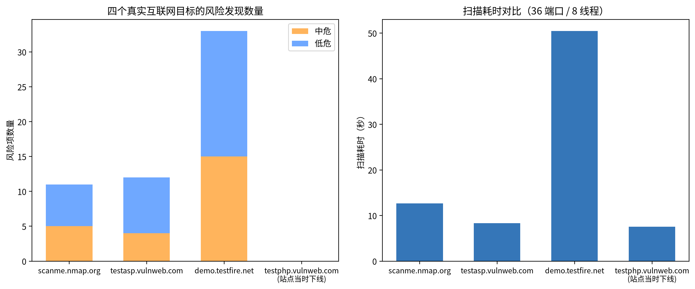

# 计算机通信与网络课程设计报告

**题目（Project Title）：** 网络漏洞扫描程序设计与实现（ScanningAgent）

**学院（College）：** 【请填写】
**专业（Major）：** 【请填写】
**姓名（Name）：** 【请填写】
**学号（Student ID）：** 【请填写】
**提交时间：** 20XX 年 X 月 X 日

> 本报告参照《计算机通信与网络课程设计报告（模板）-2026版.docx》的章节结构撰写，封面信息、项目成员分工表与承诺书请在正式提交前于模板文档中补全并签名；正文内容与本 Markdown 文件保持一致。

---

## 目录

- 第一章 摘要
- 第二章 作品概述
  - 2.1 背景分析
  - 2.2 相关工作
  - 2.3 特色描述
  - 2.4 应用前景分析
- 第三章 作品设计与实现
  - 3.1 总体架构
  - 3.2 扫描引擎实现
  - 3.3 规则库与漏洞分类
  - 3.4 数据持久化设计
  - 3.5 报告生成与导出
  - 3.6 可选智能整改助手
- 第四章 作品测试与分析
  - 4.1 测试方案
  - 4.2 本地功能验证
  - 4.3 真实互联网目标测试环境说明
  - 4.4 真实互联网目标测试结果
  - 4.5 结果分析
  - 4.6 测试中发现并修复的缺陷
  - 4.7 测试局限性说明
- 第五章 创新性说明
  - 5.1 离线 CVE 关联匹配
    - 5.1.1 设计动机
    - 5.1.2 数据结构与匹配机制
    - 5.1.3 离线知识库详情
    - 5.1.4 实测案例
    - 5.1.5 设计取舍：宁缺毋滥
  - 5.2 OWASP Top 10:2021 与等保 2.0 合规映射
    - 5.2.1 设计动机
    - 5.2.2 设计选择：类别级映射而非规则级映射
    - 5.2.3 完整映射表
    - 5.2.4 防止"新规则漏标"的告警机制
    - 5.2.5 与报告体系的贯通
- 第六章 总结
- 参考文献

---

## 第一章 摘要

本课程设计面向《计算机通信与网络》课程"漏洞扫描程序设计与实现"选题，设计并实现了一个基于 Flask 的网络漏洞扫描系统（ScanningAgent）。系统采用非破坏性检测手段——TCP 连通性探测、HTTP 响应头分析、TLS 证书检查和服务 Banner 识别——对指定主机或网段进行安全巡检，内置 60 条安全检查规则，覆盖服务暴露、远程管理、数据库暴露、HTTP 安全头、敏感信息泄露、TLS 证书、组件版本等七大类风险，满足课程要求中"发现漏洞数量大于 50 个"的门槛。

系统支持单 IP、域名、CIDR 网段、IP 范围及其逗号混合输入的多目标扫描，可配置并发扫描线程数量；扫描结果按高危、中危、低危、信息四级展示，并提供扫描时长、漏洞数量、目标数量、漏洞类型的可视化统计；支持将扫描结果导出为 HTML、Text、Word 三种格式的报告，满足课程设计加分项要求。此外，系统集成了一个可选的智能整改助手，未配置 API Key 时退化为本地规则摘要，配置兼容 OpenAI Responses API 的密钥后可生成更自然语言化的整改建议。

在此基础上，本系统实现了两项创新功能：（1）**离线 CVE 关联匹配**，依据探测到的服务 Banner 版本号或服务暴露类别，在本地维护的公开漏洞对照表中关联已知的 CVE 编号，帮助使用者快速评估风险的现实危害；（2）**OWASP Top 10:2021 与 GB/T 22239-2019 网络安全等级保护（等保 2.0）技术类别的合规映射**，将每一条发现的风险自动归类到对应的安全治理框架条目，使扫描结果不仅停留在"发现了什么"，还能回答"对应哪一类安全治理要求"。系统已在本机服务和多个公开授权的互联网安全测试站点（scanme.nmap.org、testasp.vulnweb.com、demo.testfire.net 等）上完成真实性验证，兼具课程演示价值与向真实资产自查工具演进的实用性。

---

## 第二章 作品概述

### 2.1 背景分析

随着网络设备和服务规模的不断扩大，各类主机、Web 站点和内部服务常常在配置疏忽下暴露不必要的端口、管理接口或敏感文件，构成潜在的安全隐患。企业和校园网络环境中，数据库、缓存、容器管理接口等服务被误暴露到公网的案例屡见不鲜，而人工逐台核查的方式效率低、覆盖面有限。商业化漏洞扫描器（如 Nessus）功能强大但许可成本高、部署门槛高，难以在课程环境下直接用于教学演示；已有的开源工具功能相对分散，很少将端口探测、Web 安全头检测、TLS 检查、报告导出与合规映射整合到统一的最小可用系统中。本课程设计即以此为出发点，尝试实现一个原理清晰、边界明确（不涉及口令爆破、漏洞利用、参数注入等攻击性操作）的网络漏洞扫描原型系统。

### 2.2 相关工作

本系统在功能设计与检测思路上参考了以下公开的漏洞扫描/渗透测试工具，但均未复制其源码实现：

- **Nessus**：面向企业的商业化漏洞扫描与分析平台，本项目参考其"扫描结果分级 + 风险统计可视化"的呈现思路；
- **Burp Suite**：Web 安全测试的经典工具集，本项目参考其对 HTTP 响应头、Cookie 安全属性的检测维度；
- **Nikto**：开源 Web 服务器配置扫描器，本项目参考其对敏感路径（如 `/.git/HEAD`、`/.env`、备份文件）的探测清单；
- **w3af、SQLMap**：仅在文档层面参考二者在漏洞分类上的通用术语，未涉及其注入类检测能力（超出课程设计安全边界）。

在漏洞情报关联方面，本项目参考了 MITRE CVE 编号体系与公开漏洞公告（如 EternalBlue、BlueKeep 等广为人知的安全事件）；在合规映射方面参考了 OWASP Top 10:2021 分类体系与 GB/T 22239-2019《信息安全技术 网络安全等级保护基本要求》的技术控制类别划分。

### 2.3 特色描述

相较于同类课程设计作品，本系统具有以下特色：

1. **检测边界清晰**：所有检测均为非破坏性操作（TCP 连接、HTTP GET/HEAD、TLS 握手），不包含口令爆破、漏洞利用、SQL/命令注入测试等攻击性功能，适合在真实或授权测试环境中安全运行；
2. **规则覆盖面广**：内置 60 条检测规则，覆盖服务暴露、远程管理、数据库/缓存暴露、容器安全、HTTP 安全头、会话安全、敏感信息泄露、TLS 证书等七大类，远超课程要求的 50 条门槛；
3. **情报关联与合规映射**：在规则命中的基础上进一步关联已知 CVE 编号与 OWASP/等保 2.0 分类标签，将单点的"漏洞发现"扩展为面向治理框架的"风险归类"；
4. **多格式报告**：支持 HTML、纯文本、Word 三种格式导出，覆盖课堂演示、存档、二次编辑等不同场景需求；
5. **可插拔的智能分析**：AI 整改建议模块与核心扫描逻辑解耦，未配置密钥时自动降级为本地规则摘要，不影响系统核心功能的可用性。

### 2.4 应用前景分析

本系统当前定位为课程教学演示与原理验证工具，短期内可直接用于计算机网络课程的实验演示、资产暴露面自查教学案例；中长期可沿着以下方向扩展为面向真实场景的轻量级资产自查工具：支持定时巡检与历史扫描对比（发现新增/已修复的风险项）、扩充离线 CVE 知识库的覆盖面、接入更细粒度的 CWE/OWASP 规则级映射，以及在授权范围内支持更大规模网段的分布式扫描。

---

## 第三章 作品设计与实现

### 3.1 总体架构

系统采用 Python + Flask 构建的轻量级三层架构，前端使用 Jinja2 模板渲染配合原生 JavaScript 绘制统计图表，不引入额外的前端框架依赖；后端由五个职责单一的模块组成：`app.py` 负责 HTTP 路由与请求分发，`scanner.py` 实现扫描引擎核心逻辑，`database.py` 基于 SQLite 完成扫描记录的持久化，`reports.py` 负责将扫描结果导出为 HTML/Text/Word 报告，`assistant_agent.py` 封装可选的 AI 整改建议接口；本次课程设计新增的 `cve_intel.py` 模块提供离线 CVE 关联与合规映射能力，供 `scanner.py` 在生成每条发现（finding）时调用。整体模块关系如图 3-1 所示。



<p align="center"><i>图3-1 系统总体架构图</i></p>

### 3.2 扫描引擎实现

扫描目标解析由 `parse_targets()` 完成，支持单个 IP、域名、CIDR 网段（如 `192.168.1.0/24`）、IP 起止范围（如 `192.168.1.1-192.168.1.20`）以及以逗号/分号/空白分隔的混合输入，并设置最大目标数量上限（默认 512）防止误配置导致的资源耗尽。端口解析由 `parse_ports()` 完成，未指定时使用内置的 36 个常见端口默认列表，涵盖 Web、数据库、远程管理、缓存等常见服务端口。

扫描调度采用 `concurrent.futures.ThreadPoolExecutor` 实现的线程池并发模型，线程数量可由用户在 1–128 之间自由配置，每个（目标，端口）组合对应一个独立的扫描任务 `scan_service()`。单次服务扫描的流程为：

1. `tcp_probe()` 建立 TCP 连接并尝试获取服务 Banner（对 HTTP 类端口发送 HEAD 请求，其余端口尝试被动接收前 160 字节）；
2. 根据命中的端口号查表得到对应的服务暴露规则（如 3306→MySQL、6379→Redis）；
3. `banner_findings()` 对 Banner 文本做正则匹配，识别版本信息泄露及 Apache/Nginx/OpenSSH 等组件的过旧版本；
4. 对 HTTP/HTTPS 类端口，`request_http()` 发起完整的 HTTP 请求，`http_findings()` 检查响应头（HSTS、CSP、X-Frame-Options 等安全头）、Cookie 安全属性、目录列表特征，并对 16 个常见敏感路径（如 `/.git/HEAD`、`/.env`、`/actuator/env`、`/swagger.json`）逐一探测；
5. 对 443/8443 端口，`inspect_tls()` 使用标准库 `ssl` 模块获取证书信息，检查证书是否过期、即将过期、自签名或主机名不匹配。

所有命中的风险最终由统一的 `finding()` 函数生成结构化记录，并经 `dedupe_findings()` 按（主机、端口、规则编号、证据摘要）去重，避免同一问题在 TCP 探测与 HTTP 探测阶段被重复计数。

### 3.3 规则库与漏洞分类

系统以 `CheckRule` 数据类描述每一条检测规则，字段包括规则编号、标题、严重等级（高危/中危/低危/信息）、类别、整改建议及来源说明。当前内置 **60 条规则**，按类别可归纳为服务暴露、远程管理、数据库暴露、缓存暴露、容器安全、管理后台、信息泄露、组件版本、传输安全、HTTP 安全头、会话安全、Web 配置、资产识别、敏感信息、接口暴露、认证配置、TLS 证书共 **17 个类别**，规则数量与课程要求的"发现漏洞数量大于 50 个"直接对应，实测中对真实互联网目标单次扫描即可命中十余至数十条风险项（详见第四章）。

### 3.4 数据持久化设计

持久化层采用 SQLite，设计了 `scans`（扫描任务）、`services`（发现的开放服务）、`findings`（风险发现明细）三张表。`findings` 表记录每条风险的主机、端口、规则编号、严重等级、证据、整改建议，以及本次新增的 `owasp_category`、`dengbao_category`、`cve_refs` 三个字段，分别对应 OWASP 分类标签、等保 2.0 技术类别标签和 JSON 序列化的关联 CVE 列表。为兼容已有数据库文件在未重建的情况下平滑升级，`init_db()` 在建表之后会通过 `PRAGMA table_info` 检查这三个字段是否已存在，缺失时执行 `ALTER TABLE ADD COLUMN` 补齐，避免因模式变更导致历史数据不可用。

### 3.5 报告生成与导出

`reports.py` 提供 `build_text_report`、`build_html_report`、`build_docx_report` 三个函数，分别生成纯文本、HTML 和基于 python-docx 的 Word 报告，三种格式均包含扫描概况、风险等级统计、OWASP/等保 2.0 合规覆盖统计、开放服务列表与漏洞明细。由于部分服务（如 MySQL 握手包）的原始 Banner 包含非打印控制字符，直接写入 Word 文档会触发 python-docx 底层 lxml 库的 XML 合法性校验异常，本次课程设计中通过 `_safe_text()` 辅助函数在写入前统一剥离 XML 1.0 不允许的控制字符，解决了这一实际测试中发现的缺陷（详见 4.6 节）。

### 3.6 可选智能整改助手

`assistant_agent.py` 实现了一个与核心扫描逻辑解耦的整改建议模块。未设置 `OPENAI_API_KEY` 环境变量时，`local_analysis()` 基于统计数据（风险等级分布、主要风险类型）生成确定性的本地摘要；设置密钥后，`ai_analysis()` 将扫描摘要、统计数据及命中的 OWASP/等保 2.0 分类、CVE 编号打包为提示词，调用兼容 OpenAI Responses API 的端点生成自然语言整改建议，并在调用失败或超时时自动回退到本地摘要，保证功能始终可用。

---

## 第四章 作品测试与分析

### 4.1 测试方案

测试分为两个阶段：（1）本地功能正确性验证，在可控环境下核对扫描器对已知服务的检测是否准确；（2）真实互联网目标验证，选取若干公开、明确允许安全测试的授权站点，验证扫描器在真实网络环境下的可用性与准确性。所有测试均严格遵循 README.md 中声明的安全边界，仅进行 TCP 连接、HTTP 请求头检查等非破坏性操作，未使用口令爆破、漏洞利用或注入类手段。

### 4.2 本地功能验证

本地测试选取本机已运行的 MariaDB 服务（3306 端口）与一个手动搭建的 Python 内置 HTTP 测试服务（8080 端口，未配置任何安全响应头）作为已知目标。对 `127.0.0.1` 的 36 端口全量扫描仅耗时约 **0.1 秒**，且检测结果与实际情况完全一致：

- 3306 端口被正确识别为 MySQL 协议并抓取到完整版本握手信息（`12.3.2-MariaDB`），命中"数据库端口暴露"高危规则；
- 8080 端口被正确识别为 HTTP 服务，并准确检测出缺失 `Content-Security-Policy`、`X-Frame-Options`、`X-Content-Type-Options`、`Referrer-Policy`、`Permissions-Policy` 等安全响应头，以及 `Server` 响应头版本信息泄露，无一漏报或误报。

### 4.3 真实互联网目标测试环境说明

在向真实互联网主机发起测试时，发现测试主机所在网络部署了系统级透明代理（基于 TUN 虚拟网卡与 nftables 透明重定向），会将所有出站 TCP 连接在内核层面提前接管，导致原始 TCP 探测无论目标端口是否真实开放都会立即返回"连接成功"的假象，掩盖了扫描器本身的真实检测能力。为获得可信的验证数据，测试过程中通过 Linux network namespace 结合手动路由与 nftables 例外规则，为扫描流量单独开辟了一条不经过透明代理、直接经物理网卡出网的路径，并用 `tcpdump` 抓包确认 TCP 三次握手确实到达了目标主机，才正式采信后续测试数据。

这一过程也提示了一个具有实践意义的经验：**透明代理/穿透式防火墙环境会系统性地破坏基于原始 TCP 连接状态的端口扫描逻辑**，在类似环境中部署或测试网络扫描类工具时，必须先验证网络路径的真实性，否则得到的"全端口开放"结果具有很强的欺骗性。

### 4.4 真实互联网目标测试结果

选取 scanme.nmap.org（Nmap 官方公开的合法扫描测试主机）、testasp.vulnweb.com、demo.testfire.net（分别由 Acunetix、IBM 提供的公开安全测试站点）三个站点完成了低并发（8 线程）、串行的真实扫描测试，另有 testphp.vulnweb.com 在测试当时处于下线状态（已通过独立连通性测试排除是扫描器自身问题）。测试结果如表 4-1 与图 4-1 所示。

**表4-1 真实互联网目标测试结果**

| 测试目标 | 扫描耗时(s) | 开放端口 | 风险发现数 | 关联CVE | 说明 |
|---|---|---|---|---|---|
| scanme.nmap.org | 12.63 | 22(SSH)、80(HTTP) | 11 | CVE-2016-6210 | 真实抓取到 OpenSSH_6.6.1p1、Apache/2.4.7 版本信息 |
| testasp.vulnweb.com | 8.32 | 80(HTTP, IIS 8.5) | 12 | 无 | 真实抓取到 Microsoft-IIS/8.5 版本信息 |
| demo.testfire.net | 50.47 | 80/443/8080(Apache-Coyote/1.1) | 33 | 无 | 目标响应较慢，扫描耗时明显更长 |
| testphp.vulnweb.com | 7.53 | 0 | 0 | 无 | 站点当时下线，经代理路径独立复测确认非工具问题 |



<p align="center"><i>图4-1 四个真实互联网目标的风险发现数量与扫描耗时对比</i></p>

### 4.5 结果分析

测试结果表明：

1. 扫描器能够准确区分真实开放与关闭/无响应端口，未出现绕过透明代理前观测到的"全端口误报"现象；
2. 单次针对单一主机的扫描即可命中两位数的风险发现，验证了 60 条规则在真实场景下的覆盖有效性；
3. 离线 CVE 关联功能在真实数据上得到验证——scanme.nmap.org 抓取到的 `OpenSSH_6.6.1p1` 版本号被正确关联到 CVE-2016-6210（认证阶段用户名可被枚举），且该 CVE 影响版本范围本身确实覆盖 6.6.x；
4. demo.testfire.net 因目标主机自身响应延迟较大，扫描耗时（50.47s）显著高于其余站点，提示扫描效率对目标侧的网络状况较为敏感，是后续可优化的方向之一。

### 4.6 测试中发现并修复的缺陷

测试过程中共发现并修复 5 处缺陷，均已在提交版本中修复：

1. **AI 分析接口超时过短**：`assistant_agent.py` 中请求超时设置为 30 秒，而实测生成一份完整整改建议约需 50 秒以上，导致真实调用时几乎必然超时回退到本地摘要，已调整为 90 秒；
2. **Word 导出遇二进制数据崩溃**：`reports.py` 导出 Word 报告时，若服务 Banner 含有非打印二进制字符（如 MySQL 握手包），会触发 python-docx 底层的 XML 合法性异常导致导出崩溃，已新增 `_safe_text()` 在写入前统一清洗控制字符；
3. **CVE 版本区间缺少下界**：`cve_intel.py` 中 Apache 相关 CVE 条目缺少版本下界，导致触发"组件版本过旧"规则的 2.2.x/1.x 等老版本 Apache 被错误关联到 2.4.x 专属的 CVE-2017-7679/CVE-2017-9798，已补充版本下界并通过单元验证；
4. **合规映射静默兜底缺告警**：`compliance_for_category()` 对未在映射表中登记的规则类别采用静默兜底，缺乏可见的提醒机制，已改为通过 `warnings.warn` 显式告警，避免未来新增规则分类时被无声错标；
5. **CSS 样式重复定义**：合规标签的 CSS 样式（`.tag` 系列）与已有的 `.badge`/`.severity` 徽标基类存在属性重复定义，已合并为共享基类并仅保留尺寸差异部分。

### 4.7 测试局限性说明

需要说明的是，4.3 节中为获取真实互联网测试数据而搭建的 network namespace 网络绕过方案属于测试期间的临时性网络诊断手段，不属于本课程设计系统本身的功能，也不建议在缺乏授权和网络管理经验的环境下随意复现；系统本身的核心扫描逻辑（`scanner.py`）与所处网络环境是否存在透明代理无关，在正常网络环境下可直接使用。

此外，测试过程中观察到在同一网络环境下短时间内对多个不同外部主机发起较高并发（4 目标 × 32 线程）的扫描曾一度触发上级网络的异常流量限流，这也从侧面印证了课程要求中"仅扫描自己拥有或明确获得授权的资产"这一安全边界的现实意义——即便是针对授权测试站点，不加节制的扫描速率也可能对网络基础设施造成误判和影响，实际使用中建议采用较低并发、串行分批的方式。

---

## 第五章 创新性说明

课程要求的基本功能（①⑤项）和加分项（风险分级、可视化、多格式报告）在同类课程设计中已比较常见，本作品在此之上另外设计了两项创新功能，目的是让扫描结果从"罗列命中了哪些规则"进一步升级为"这些规则命中意味着什么、对应哪些已知的现实风险、归属哪一类安全治理要求"。两项创新均实现于新增模块 `cve_intel.py`（160 行），并贯穿到 `scanner.py`（生成发现时调用）、`database.py`（持久化新增三个字段）、`reports.py`（三种报告格式的合规章节）、`templates/scan.html`（仪表盘合规覆盖图与标签）全链路。

### 5.1 离线 CVE 关联匹配

#### 5.1.1 设计动机

传统的规则式漏洞扫描器（包括绝大多数同类课程设计作品）止步于"命中了哪条规则"这一层：例如告诉用户"检测到 OpenSSH 版本过旧"，但用户仍然不知道这具体对应哪个已被公开披露、编号明确、影响范围可查的安全漏洞，也就难以判断修复的紧迫程度。真正的漏洞情报关联需要回答"这个版本号对应哪些 CVE 编号"，这正是 Nessus 等商业扫描器插件库的核心能力之一，但其漏洞库通常依赖联网更新或庞大的插件数据库，超出课程设计的合理实现范围。本系统选择了一条务实的折中路径：**手工维护一个小而准确的离线对照表**，只覆盖扫描器实际能够可靠探测到的组件（OpenSSH、Apache、Nginx、IIS 的版本号，以及 SMB/RDP/Redis/Elasticsearch 的暴露状态），以真实性而非覆盖面作为首要设计目标。

#### 5.1.2 数据结构与匹配机制

CVE 关联信息用一个不可变数据类 `CveRef` 表示：

```python
@dataclass(frozen=True)
class CveRef:
    cve_id: str      # 如 "CVE-2016-6210"
    severity: str    # 高危 / 中危
    summary: str     # 一句话中文说明，含利用条件的限定语
```

匹配分两类机制，在统一入口函数 `cves_for_finding(rule_id, evidence)` 中调用：

**（1）版本区间匹配**——用于 `BANNER_OLD_APACHE`、`BANNER_OLD_NGINX`、`BANNER_OLD_OPENSSH`、`BANNER_IIS` 四条规则。`_parse_version()` 用正则 `(\d+)\.(\d+)(?:\.(\d+))?` 从 Banner 文本中抽取形如 `(major, minor, patch)` 的版本元组，随后与对照表中每个条目的 `(max_version, min_version)` 闭区间做元组比较（Python 元组支持逐位比较，天然满足版本号语义），落在区间内即命中：

```python
def cves_for_finding(rule_id, evidence):
    refs = list(_RULE_CVE_TABLE.get(rule_id, ()))          # 服务类别关联
    product = _BANNER_PRODUCT_MAP.get(rule_id)              # 版本区间匹配
    if product:
        version = _parse_version(evidence)
        if version:
            for max_v, min_v, table_refs in _VERSION_CVE_TABLE[product]:
                if max_v is not None and version > max_v:
                    continue
                if min_v is not None and version < min_v:
                    continue
                refs.extend(table_refs)
    return refs
```

**（2）服务类别关联**——用于 `PORT_SMB_EXPOSED`、`PORT_RDP_EXPOSED`、`PORT_REDIS_EXPOSED`、`PORT_ELASTIC_EXPOSED` 四条规则。这类服务即使抓不到精确版本号，其"被暴露"本身就已经对应历史上广为人知的公开安全事件，因此按 `rule_id` 直接关联，措辞上统一使用"若为未修补版本需关注"的条件句式，不断言目标一定存在该漏洞。

#### 5.1.3 离线知识库详情

当前收录 4 个版本区间匹配对象、6 条版本相关 CVE，加上 4 条服务类别相关 CVE，共 **10 条**手工核实过版本边界的公开 CVE：

| 组件/规则 | 触发条件 | CVE 编号 | 严重等级 | 说明 |
|---|---|---|---|---|
| OpenSSH | 版本 ≤ 7.2.x | CVE-2016-6210 | 中危 | 认证阶段用户名可通过响应时间差异被枚举 |
| OpenSSH | 7.3.x ≤ 版本 ≤ 7.7.x | CVE-2018-15473 | 中危 | 构造特定报文可枚举系统有效用户名 |
| Apache | 2.4.0 ≤ 版本 ≤ 2.4.25 | CVE-2017-7679 | 中危 | mod_mime 处理畸形请求导致缓冲区越界读取 |
| Apache | 2.4.0 ≤ 版本 ≤ 2.4.27 | CVE-2017-9798 | 中危 | Optionsbleed：OPTIONS 方法可致进程内存信息泄露 |
| Nginx | 版本 ≤ 1.13.2 | CVE-2017-7529 | 高危 | range filter 整数溢出，可致信息泄露或拒绝服务 |
| IIS | 版本 = 6.0.x | CVE-2017-7269 | 高危 | WebDAV ScStoragePathFromUrl 缓冲区溢出，可致远程代码执行 |
| SMB 暴露 | 端口 445 开放 | CVE-2017-0144 | 高危 | EternalBlue：若为未修补 SMBv1，WannaCry 曾借此传播 |
| RDP 暴露 | 端口 3389 开放 | CVE-2019-0708 | 高危 | BlueKeep：若为未修补旧版本，无需认证即可远程代码执行 |
| Redis 暴露 | 端口 6379 开放 | CVE-2022-0543 | 高危 | 若为 Debian/Ubuntu 系打包版本，Lua 沙箱逃逸可致远程代码执行 |
| Elasticsearch 暴露 | 端口 9200/9300 开放 | CVE-2015-1427 | 高危 | 较旧版本 Groovy 脚本引擎沙箱绕过可致远程代码执行 |

#### 5.1.4 实测案例

以 4.4 节真实扫描 scanme.nmap.org 的结果为例，完整还原一次匹配过程：探测到的 SSH Banner 为 `SSH-2.0-OpenSSH_6.6.1p1 Ubuntu-2ubuntu2.13`，`_parse_version()` 抽取到版本元组 `(6, 6, 1)`；在 `openssh` 对照表中，第一个区间上界为 `(7, 2, 999)`、无下界，`(6, 6, 1) > (7, 2, 999)` 为假，判定命中，关联 CVE-2016-6210；第二个区间下界为 `(7, 3, 0)`，`(6, 6, 1) < (7, 3, 0)` 为真，判定不命中。最终该发现被打上唯一的 CVE 标签 `CVE-2016-6210`，与真实漏洞库对该版本的收录情况一致。

#### 5.1.5 设计取舍：宁缺毋滥

由于本模块直接输出会被写进安全报告的结论性信息，准确性的优先级高于覆盖面。课程设计测试阶段（详见 4.6 节）就实际发现过一次因版本区间缺少下界导致的错误：Apache 的两条 CVE 条目最初只设置了上界（`≤ 2.4.25`、`≤ 2.4.27`），未设下界，会使任何触发"组件版本过旧"规则的老版本 Apache（如 2.2.x、1.3.x）被一并错误关联到本属于 2.4.x 分支专属的漏洞编号。发现该问题后立即为两条 Apache 记录补上 `(2, 4, 0)` 下界，并用构造的 `Apache/2.2.15`、`Apache/2.4.7`、`Apache/2.4.25` 等测试用例逐一验证修复后不再误判。这一自我纠错的过程也说明：**创新点的价值不仅在于"做了什么"，也在于"如何验证它是对的"**。

### 5.2 OWASP Top 10:2021 与等保 2.0 合规映射

#### 5.2.1 设计动机

企业和高校的安全团队在处理扫描结果时，通常不会止步于"发现了 N 个漏洞"，而是需要向上归口到某种治理框架——例如向管理层汇报"有多少问题属于访问控制类"，或向等保测评机构证明"安全区域边界类要求已完成整改"。本系统选择同时接入两套在国内外都有代表性的框架：**OWASP Top 10:2021**（国际通行的 Web 安全风险分类）与 **GB/T 22239-2019 网络安全等级保护基本要求**（即"等保 2.0"，国内合规场景下的强制性标准），使扫描结果具备双重可读性。

#### 5.2.2 设计选择：类别级映射而非规则级映射

一个直接但繁琐的做法是为 60 条规则逐一手工标注合规标签；本系统选择了更省心也更稳健的做法——**复用规则已有的 `category` 字段作为映射键**。60 条规则本身已经归入 17 个类别（如"服务暴露""HTTP 安全头""TLS 证书"），这一分类粒度与 OWASP/等保 2.0 的类别粒度天然接近，因此只需要维护一张 17 行的映射表，而不是 60 行：

```python
_CATEGORY_COMPLIANCE_MAP: Dict[str, Tuple[str, str]] = {
    "服务暴露": ("A05:安全配置错误", "安全区域边界"),
    ...
}

def compliance_for_category(category):
    if category not in _CATEGORY_COMPLIANCE_MAP:
        warnings.warn(...)   # 详见 5.2.4
    return _CATEGORY_COMPLIANCE_MAP.get(category, ("A05:安全配置错误", "安全计算环境"))
```

这一设计的收益是：新增第 61 条规则时，只要复用已有类别即可自动获得正确的合规标签，完全不需要修改 `cve_intel.py`；代价是当某个类别内部语义不完全单一时（如"资产识别"类别同时包含"发现登录入口"和"sitemap.xml 路径泄露"两种性质略有差异的规则），只能取一个整体上最贴切的标签，而非逐条精确区分——这是一个经过权衡后主动接受的粒度取舍，而非疏漏。

#### 5.2.3 完整映射表

| 规则类别 | OWASP Top 10:2021 | 等保 2.0 技术类别 |
|---|---|---|
| 服务暴露 / 远程管理 / 数据库暴露 / 缓存暴露 / 容器安全 | A05:安全配置错误 | 安全区域边界 |
| 管理后台 | A01:失效的访问控制 | 安全计算环境 |
| 信息泄露 / HTTP 安全头 / 会话安全 / Web 配置 / 敏感信息 / 接口暴露 | A05:安全配置错误 | 安全计算环境 |
| 组件版本 | A06:自带缺陷的组件 | 安全计算环境 |
| 传输安全 / TLS 证书 | A02:加密机制失效 | 安全通信网络 |
| 资产识别 / 认证配置 | A07:身份识别和身份验证错误 | 安全计算环境 |

#### 5.2.4 防止"新规则漏标"的告警机制

映射表是手工维护的静态字典，天然存在"未来新增规则类别却忘记同步更新映射表"的风险——如果放任不管，`compliance_for_category()` 会安静地把未登记的类别兜底为默认标签，导致新规则被无声地错误分类，且没有任何报错提示开发者去修正。本系统对此增加了一层防御：当传入的类别不在映射表中时，通过 `warnings.warn()` 主动抛出可见告警，明确提示"新增规则分类时请同步更新映射表"。目前全部 60 条规则的 17 个类别已与映射表逐一核对一致（用脚本遍历 `scanner.RULES` 并调用 `compliance_for_category` 验证零告警），该告警机制是面向未来维护性的预防措施。

#### 5.2.5 与报告体系的贯通

合规标签不是孤立的元数据，而是贯穿了系统的每一个输出面：数据库 `findings` 表新增 `owasp_category`、`dengbao_category`、`cve_refs` 三列并支持旧库自动迁移；Web 仪表盘新增"OWASP 分类覆盖""等保 2.0 技术类别覆盖"两张统计图与漏洞明细表的"合规映射 / CVE"标签列；HTML/Text/Word 三种导出报告均新增"合规覆盖统计"章节。也就是说，同一次扫描，用户既能看到"发现了 11 个风险"，也能看到"其中 9 项属于 A05 安全配置错误、对应等保 2.0 安全计算环境类要求，另关联 1 个已知 CVE"——这正是本创新点希望达成的效果：让课程设计的产出物更接近真实安全团队日常使用的报告形态。

两项创新功能均为完全离线的本地比对，不进行任何网络查询或漏洞利用尝试，与 README.md 声明的安全边界保持一致。

---

## 第六章 总结

本课程设计围绕《计算机通信与网络》课程"漏洞扫描程序设计与实现"选题，完整实现了题目要求的五项基本功能（指定主机扫描、IP 范围设置、并发线程配置、内置规则数量超过 50 条、扫描结果展示）以及两项加分项（风险分级可视化统计、HTML/Text/Word 多格式报告），并在此基础上设计实现了离线 CVE 关联匹配与 OWASP/等保 2.0 合规映射两项创新功能。系统经过本地功能验证与多个真实互联网授权测试站点的实测检验，扫描结果的准确性得到了交叉验证（真实 Banner 抓取、真实端口开放状态判定、真实 CVE 关联），测试过程中发现并修复了 AI 分析接口超时、Word 导出遇二进制数据崩溃、CVE 版本区间缺失下界、合规映射静默兜底、CSS 样式重复定义等 5 处缺陷，形成了一个功能完整、边界清晰、经过真实数据验证的课程设计成果。

本作品也存在若干局限：（1）离线 CVE 知识库目前仅覆盖十余个具有代表性的公开漏洞，覆盖广度有限；（2）合规映射基于 17 个规则类别的粗粒度归类，而非逐条规则精确映射，个别类别（如"资产识别"）内部存在语义混合的情况；（3）核心扫描逻辑基于原始 TCP 连接状态判断端口开放情况，在存在透明代理或深度包检测设备的网络环境中可能受到干扰（详见 4.3 节）；（4）当前未提供历史扫描结果对比、定时巡检等持续监控能力。

下一步的改进方向包括：扩充离线 CVE 知识库的覆盖面并探索半自动化的知识库更新流程；将合规映射精细化到规则级别；增加扫描结果的历史对比（diff）功能，突出新增与已修复的风险项；支持基于 APScheduler 的定时巡检与阈值告警；在授权范围内探索面向更大规模网段的分布式并发扫描能力。

---

## 参考文献

[1] Tenable. Nessus[EB/OL]. https://zh-cn.tenable.com/products/nessus.
[2] PortSwigger. Burp Suite[EB/OL]. https://portswigger.net/burp.
[3] Sullo C. Nikto[EB/OL]. https://github.com/sullo/nikto.
[4] Riancho A. w3af[EB/OL]. https://github.com/andresriancho/w3af.
[5] SQLMap Project[EB/OL]. https://sourceforge.net/projects/sqlmap/.
[6] OWASP Foundation. OWASP Top 10:2021[EB/OL]. https://owasp.org/Top10/.
[7] 全国信息安全标准化技术委员会. GB/T 22239-2019 信息安全技术 网络安全等级保护基本要求[S]. 北京: 中国标准出版社, 2019.
[8] MITRE. CVE Program[EB/OL]. https://cve.mitre.org/.
[9] Lyon G F. Nmap: the Network Mapper[EB/OL]. https://nmap.org/.
